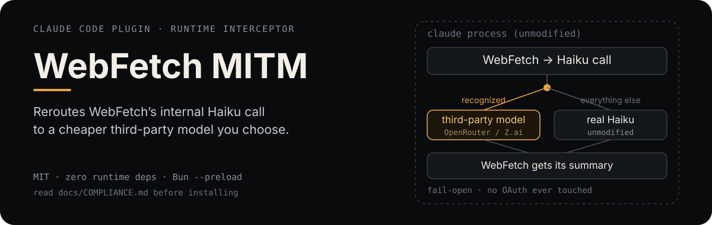

# Claude Code WebFetch MITM

<p align="center">
  
</p>

<p align="center"><a href="README.zh-CN.md">中文</a></p>

<p align="center"><sub>Unofficial, community-built project. Not affiliated with or endorsed by Anthropic. "Claude Code" is a trademark of Anthropic, PBC.</sub></p>

## What it does

`WebFetch` fetches a page, then makes a second, internal call to Haiku to
summarize what it found. This project injects a small script into the
`claude` process at startup (via Bun's own documented `--preload`
mechanism) that recognizes *only* that specific internal call and forwards
it to a third-party model instead — currently OpenRouter or Z.ai, your
choice.

Everything else — the main conversation, other tool calls, MCP traffic,
authentication — passes through completely untouched. If the third-party
call fails or times out for any reason, the request falls through
automatically to the real Haiku call; `WebFetch` never breaks because of
this.

## Before you use this

> This project sits in a real gray area of Anthropic's usage policies — not
> clearly compliant, not clearly forbidden. Read
> **[docs/COMPLIANCE.md](docs/COMPLIANCE.md)** ([中文](docs/COMPLIANCE.zh-CN.md))
> before installing it.

It documents exactly what was checked against Anthropic's published terms,
what's known, and what isn't — written so you can make your own call, not
to sell you on using this.

## Install

Installation here is unusual — no package to install, just a config file
and a shell function. Full walkthrough:
**[INSTALL.md](INSTALL.md)** ([中文](INSTALL.zh-CN.md)).

If you'd rather not do it by hand, that file is written to be handed
straight to a coding agent — open a terminal in this project and ask it to
read `INSTALL.md` and set things up for you. Either way, **you must fully
close and reopen your terminal window** after configuring it before it
takes effect.

## Configuration

All configuration lives in `.env` (copy `.env.example` to start). See
[INSTALL.md](INSTALL.md) for the full walkthrough; in short:

| Variable | Meaning |
|---|---|
| `WEBFETCH_MITM_PROVIDER` | `openrouter` or `zai` |
| `WEBFETCH_MITM_OPENROUTER_API_KEY` / `WEBFETCH_MITM_OPENROUTER_MODELS` | OpenRouter branch — key and a comma-separated model fallback list |
| `WEBFETCH_MITM_ZAI_API_KEY` / `WEBFETCH_MITM_ZAI_MODELS` | Z.ai branch — key and a comma-separated model fallback list |
| `WEBFETCH_MITM_PROMPT_FILE` | Optional absolute path to your own summarization prompt template |
| `WEBFETCH_MITM_ENABLE_TARGETS` | Which internal call sites to intercept; currently only `webfetch` exists |

## How it works

```
claude process
 └─ WebFetch tool fetches a page
     └─ internal call to Haiku to summarize it   ← the only thing this project touches
         ├─ recognized?  → forward to your chosen third-party model
         │                  success → synthesize a matching response, done
         │                  failure/timeout/unrecognized shape → fall through ↓
         └─ not recognized, or fallback path      → real Haiku call, unmodified
```

- **`interceptor`** — wraps `fetch`, decides whether a request matches a
  known internal call site.
- **`matchRules`** — one recognizer per internal call site this project
  knows about; only `webfetch` is implemented today.
- **`providers`** — one module per third-party backend (`openrouter`,
  `zai`); each exposes the same "succeeded or failed" interface upward.
- **`responseSynthesizer`** — wraps the third-party model's answer back
  into the same streamed response shape Claude Code expects.

Circuit breaker: if a provider fails several times in a row within one
`claude` process, the rest of that process's lifetime skips straight to
passthrough rather than paying a timeout on every call.

## Testing

```bash
bun test
bun run typecheck
```

## License

[MIT](LICENSE).
