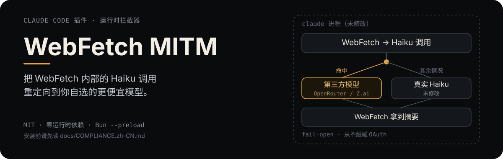

# Claude Code WebFetch MITM

<p align="center">
  
</p>

<p align="center"><a href="README.md">English</a></p>

<p align="center"><sub>非官方的社区项目，与 Anthropic 无附属关系，未获其认可。"Claude Code" 是 Anthropic, PBC 的商标。</sub></p>

## 这个项目做什么

`WebFetch` 抓到一个网页之后，会另外发一次内部调用给 Haiku 做摘要。这个项目通过 Bun 官方文档
化的 `--preload` 机制，在 `claude` 进程启动时注入一段脚本，这段脚本**只**识别这一个具体的
内部调用，把它转发给你选定的第三方模型——目前支持 OpenRouter 或 Z.ai，二选一。

其余所有流量——主对话、其他工具调用、MCP 通信、身份认证——完全不受影响、原样通过。如果第三方
调用因为任何原因失败或超时，请求会自动摔回真实的 Haiku 调用；`WebFetch` 不会因为装了这个工具
而变得不可用。

## 用之前先看这个

> 这个项目落在 Anthropic 使用政策的一个真实灰色地带——不是明显合规，也不是明显被禁止。安装
> 之前先读 **[docs/COMPLIANCE.zh-CN.md](docs/COMPLIANCE.zh-CN.md)**（
> [English](docs/COMPLIANCE.md)）。

里面记录了对照 Anthropic 公开条款具体核实过什么、能确定什么、不能确定什么——目的是让你自己
判断，不是说服你使用。

## 安装

安装方式比较特别——没有包要装，只是一个配置文件加一个 shell 函数。完整步骤见
**[INSTALL.zh-CN.md](INSTALL.zh-CN.md)**（[English](INSTALL.md)）。

不想手动一步步做的话，那份文件本身就是写给 Agent 看的——在项目目录下开个终端，让你的 Agent
读 `INSTALL.zh-CN.md` 帮你配置。不管哪种方式，配置完成后**都必须把终端窗口完整关掉再重新
打开**，配置才会生效。

## 配置

所有配置都在 `.env` 里（从 `.env.example` 拷贝一份开始）。完整说明见
[INSTALL.zh-CN.md](INSTALL.zh-CN.md)，简要如下：

| 变量 | 含义 |
|---|---|
| `WEBFETCH_MITM_PROVIDER` | `openrouter` 或 `zai` 二选一 |
| `WEBFETCH_MITM_OPENROUTER_API_KEY` / `WEBFETCH_MITM_OPENROUTER_MODELS` | OpenRouter 分支——API key 和逗号分隔的模型 fallback 列表 |
| `WEBFETCH_MITM_ZAI_API_KEY` / `WEBFETCH_MITM_ZAI_MODELS` | Z.ai 分支——API key 和逗号分隔的模型 fallback 列表 |
| `WEBFETCH_MITM_PROMPT_FILE` | 可选，指向你自己摘要提示词模板的绝对路径 |
| `WEBFETCH_MITM_ENABLE_TARGETS` | 拦截哪些内部调用点；目前只实现了 `webfetch` 一个 |

## 工作原理

```
claude 进程
 └─ WebFetch 工具抓取一个网页
     └─ 内部调用 Haiku 做摘要        ← 这个项目唯一触碰的地方
         ├─ 识别命中？ → 转发给你选定的第三方模型
         │                成功 → 合成一份格式一致的响应返回，结束
         │                失败/超时/返回结构不认识 → 摔回 ↓
         └─ 未命中，或走到 fallback 路径  → 真实 Haiku 调用，不受影响
```

- **`interceptor`**：包装 `fetch`，判断一次请求是否命中某个已知的内部调用点。
- **`matchRules`**：每个内部调用点对应一个识别器；目前只实现了 `webfetch` 这一个。
- **`providers`**：每个第三方后端（`openrouter`、`zai`）各一个模块，对上层统一暴露"成功/
  失败"这一个结果。
- **`responseSynthesizer`**：把第三方模型的回答重新包装成 Claude Code 期望的流式响应格式。

熔断机制：同一个 `claude` 进程内，某个 provider 连续失败若干次后，这个进程剩余的生命周期里
直接退化为透传，不再为每次调用都白等一次超时。

## 测试

```bash
bun test
bun run typecheck
```

## License

[MIT](LICENSE)。
